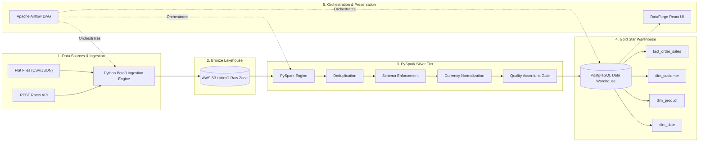

# ⚡ DataForge: E-Commerce Data Platform

> **Modern End-to-End Lakehouse & Dimensional Warehouse Platform**  
> *Built with Python, PySpark, AWS S3 / MinIO, Apache Airflow, PostgreSQL, Docker & React.*

---

## 🌟 Executive Summary & Resume Highlights

- **End-to-End ETL Pipeline**: Ingests heterogeneous e-commerce data (orders CSV, customer records, JSON catalogs, and REST currency exchange rates) into an immutable S3 bronze landing zone using Python and Boto3.
- **Distributed PySpark Transformation**: Implements distributed transformations covering schema enforcement, type coercion, timestamp parsing, deduplication, currency normalization, and multi-table joins.
- **Dimensional Data Warehouse (PostgreSQL)**: Designed a Star Schema (`fact_order_sales`, `dim_customer`, `dim_product`, `dim_date`) loaded idempotently with pre-computed analytical aggregation views.
- **Data Quality & Automated Orchestration**: Enforced strict assertion gates (null checks, foreign key integrity, non-negative bounds) within an Apache Airflow DAG configured for daily batch execution, retries, and failure alerts.
- **Containerized Architecture**: Multi-container stack managed via Docker Compose (`MinIO`, `PostgreSQL`, `Airflow Webserver/Scheduler`) plus a dedicated React & Tailwind monitoring UI.

---

## 🏗️ Architecture Overview



---

## 🚀 Quick Start Guide

### 1. Prerequisites
- Docker & Docker Compose
- Python 3.10+
- Node.js 18+ (for UI)

### 2. Generate Sample Data & Test ETL Locally
```bash
# 1. Generate realistic e-commerce datasets and mock REST responses
python3 src/ingestion/sample_generator.py

# 2. Run PySpark transformation & deduplication
python3 src/transformation/spark_transform.py

# 3. Load Star-Schema Warehouse
python3 src/warehouse/loader.py
```

### 3. Spin up Full Containerized Stack
```bash
docker-compose up -d
```
- **Airflow Webserver**: [http://localhost:8080](http://localhost:8080) (User/Pass: `airflow` / `airflow`)
- **MinIO Console**: [http://localhost:9001](http://localhost:9001) (User/Pass: `minioadmin` / `minioadmin`)
- **PostgreSQL Warehouse**: `localhost:5432` (`dataforge_db`)

### 4. Launch Monitoring & Analytics UI
```bash
cd ui
npm install
npm run dev
```
Visit [http://localhost:5173](http://localhost:5173) to trigger runs, view data quality metrics, and inspect dimensional tables.

---

## 📊 Warehouse Star-Schema Reference

| Table | Type | Key Columns / Attributes | Description |
| :--- | :--- | :--- | :--- |
| `fact_order_sales` | Fact | `order_id` (PK), `customer_id` (FK), `product_id` (FK), `date_id`, `amount_usd`, `order_status` | Granularity: 1 row per order transaction normalized to USD |
| `dim_customer` | Dimension | `customer_id` (PK), `first_name`, `last_name`, `email`, `city`, `signup_date` | Conformed customer dimension |
| `dim_product` | Dimension | `product_id` (PK), `product_name`, `category`, `base_price` | Conformed product catalog |
| `dim_date` | Dimension | `date_id` (PK: YYYYMMDD), `full_date`, `year`, `quarter`, `month`, `is_weekend` | Time dimension for OLAP rollups |

---

## 🛡️ Reliability & Data Quality Standards

1. **Idempotency**: All ingestion and load steps employ deterministic upserts (`ON CONFLICT` / replace).
2. **Quality Gates**: PySpark assertions verify zero null keys and non-negative amounts before warehouse loads.
3. **Reproducibility**: Complete local execution via MinIO without requiring paid cloud infrastructure.
